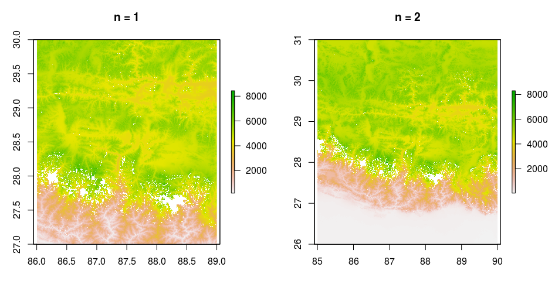

Download SRTM elevation maps locally and load them into R. The files correspond to the [SRTM3 V2.1](https://dds.cr.usgs.gov/srtm/version2_1/SRTM3/) maps.

Install the SRTM package from Github:

```r
require(devtools)
install_github('jsga/SRTM_maps_in_R')
```

Load the library, download the elevation maps around mount Everest and plot them:

```r
library(SRTM)
everest =  get_srtm_raster(lon = 86.922623, lat = 27.986065 , n=1, exdir_srtm_hgt = "data-raw/SRTM_maps_everest") 
# Takes a while the first time
# See downloaded .hgt files in data-raw/SRTM_maps_everest
raster::plot(everest)
```
The number of tiles downloaded depend on the option *n*. For _n=1_, the center tile is downloaded plus each 1 surrounding tile. So, 9 in total. For _n=2_ the center tile plus 2 surrounding tiles, meaning 25 in total. In general, _(2*n+1)^2_ tiles are downloaded. The graph below shows the output for _n=1_ and _n=2_:




The package also contains a dataset that has saves the location of each tile on the [server](https://dds.cr.usgs.gov/srtm/version2_1/SRTM3/):

```r
head(SRTM::SRTM_files_info)
```
```
full_path name_file NS coorNS WE coorWE
1 https://dds.cr.usgs.gov/srtm/version2_1/SRTM3/Africa/N00E006.hgt.zip   N00E006  N      0  E      6
2 https://dds.cr.usgs.gov/srtm/version2_1/SRTM3/Africa/N00E009.hgt.zip   N00E009  N      0  E      9
3 https://dds.cr.usgs.gov/srtm/version2_1/SRTM3/Africa/N00E010.hgt.zip   N00E010  N      0  E     10
4 https://dds.cr.usgs.gov/srtm/version2_1/SRTM3/Africa/N00E011.hgt.zip   N00E011  N      0  E     11
5 https://dds.cr.usgs.gov/srtm/version2_1/SRTM3/Africa/N00E012.hgt.zip   N00E012  N      0  E     12
6 https://dds.cr.usgs.gov/srtm/version2_1/SRTM3/Africa/N00E013.hgt.zip   N00E013  N      0  E     13
```


